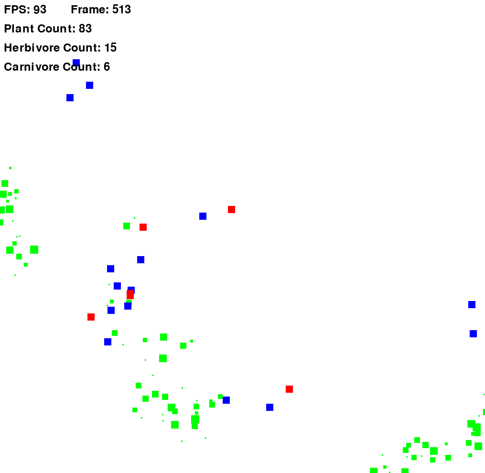
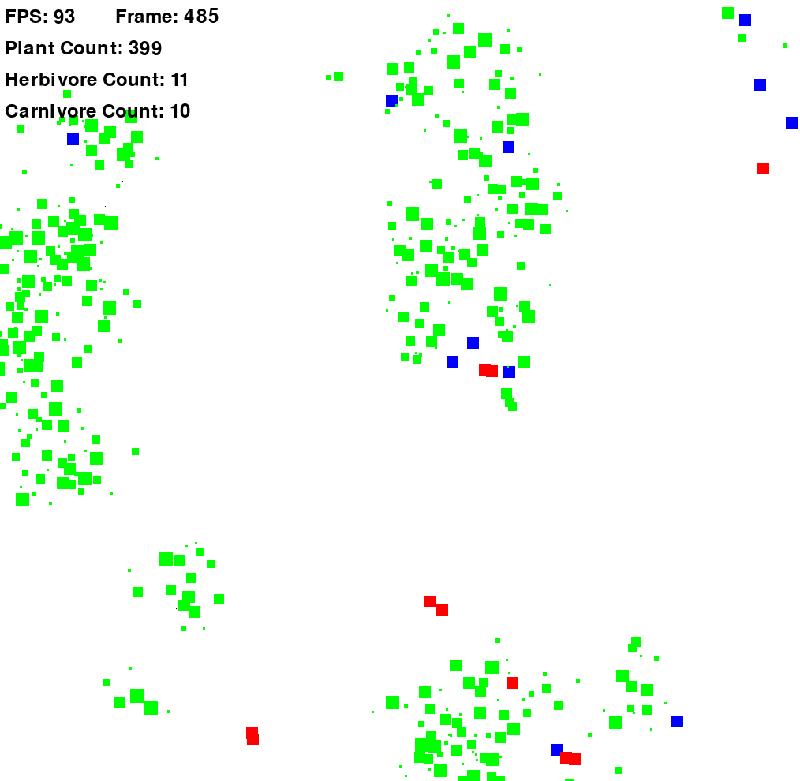
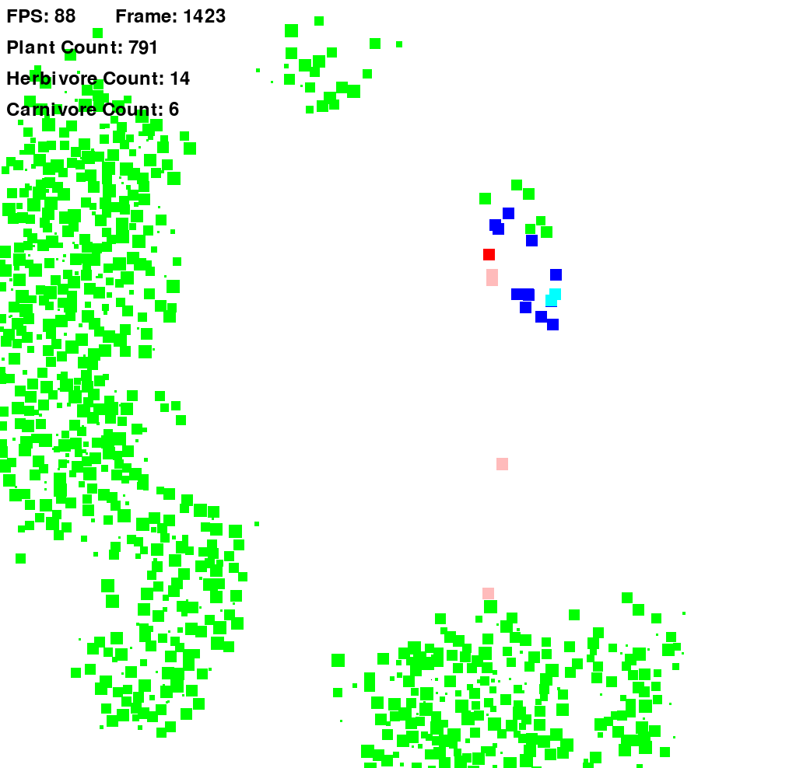
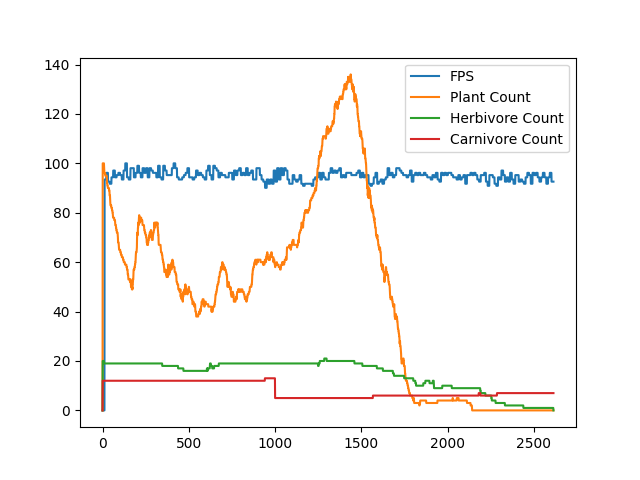
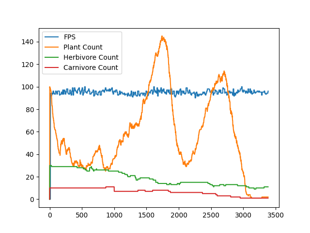
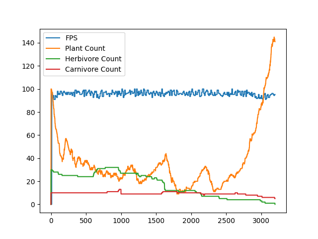

## Nature Simulation

This project is a simulation of a natural environment created using Python and Pygame. In this environment, plants, herbivores, and carnivores coexist, demonstrating various behaviors such as growth, reproduction, and predation.

### Class Hierarchy

- Living
  - | - Plant
  - | - Animal
    - | Herbivore
    - | Carnivore


### Plant Features

- **Plant Growth**: Plants grow autonomously within the environment.
- **Reproduction**: Plants reproduce within a defined radius.
- **Population Control**: Plants die if their surface is covered by more than 50% by other plants.

### Herbivore Features

- **Movement**: Herbivores move and search for plants to consume.
- **Reproduction**: Herbivores search for partners to reproduce when they reach a certain age and are sufficiently fed.

### Carnivore Features

- **Predation**: Carnivores hunt and consume herbivores.
- **Reproduction**: Carnivores also search for partners to reproduce when they reach a certain age and are sufficiently fed.

### Implementation Details

- **Graphics**: Pygame library handles the graphic aspects of the simulation.
- **Physics**: Collision detection is primarily handled by a grid detection mechanism to minimize calls to Pygame's `collideRect` method.
- **Configuration**: The simulation parameters can be modified using `config.json` files for the main settings, plants, herbivores, and carnivores :
  - [main config](Configs/config.json)
  - [plant config](Configs/plant_config.json)
  - [herbivore config](Configs/herbivore_config.json)
  - [carnivore config](Configs/carnivore_config.json)

- **Execution**: To launch the simulation, simply run the main file.

### Simulation Data Visualization

At the conclusion of each simulation run, the program generates a matplotlib graph displaying data about the simulation.
This graph provides metrics such as frames per second (fps), plant count, herbivore count, and carnivore count 
throughout the duration of the simulation. 

### Screenshots

#### Runs
[](Screenshots/run1.png)
[](Screenshots/run2.png)
[](Screenshots/run3.png)

#### Graphs
[](Screenshots/graph1.png)
[](Screenshots/graph2.png)
[](Screenshots/graph3.png)


### Usage

To run the simulation:

```bash
python main.py
```
### Requirements

Python 3.x
Pygame

###Contributions

Contributions are welcome! Feel free to submit pull requests or open issues for any improvements or features.